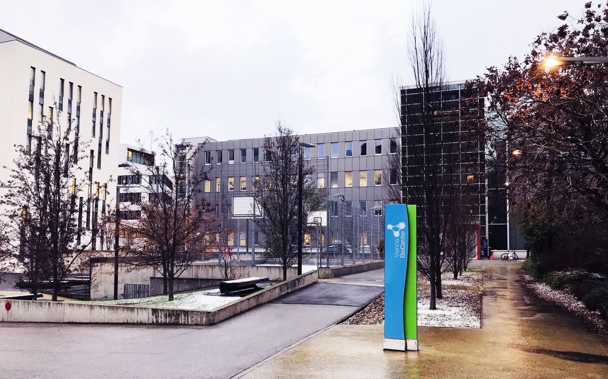

# Đường đến Vienna BioCenter

Chào mừng bạn đã đặt chân đến Áo! Bạn đang ở thành phố Kinh đô nghệ thuật, thành phố đáng sống nhất thế giới, Wien!

Vậy là ước mơ bấy lâu của mình đã thành hiện thực, mình còn chưa tin được mình đang ở châu Âu! Cuối cùng giấc mơ chạm đến môi trường học thuật với các nghiên cứu đột phá đã bắt đầu trở thành hiện thực. Mình thật sự hạnh phúc vô cùng!Ngồi trên xe về ký túc xá, mình như đứa trẻ lạc vào thiên đường cổ tích, Wien đẹp quá, đẹp choáng ngợp bởi sự cổ kính, trật tự và bình yên. Mình trầm trồ suốt với thầy khi từ sân bay về nhà. Đến Wien vào một ngày đông, khi mà nền nhiệt ở đây vào độ lạnh nhất năm, thầy bảo mình rất may mắn khi đến vào đúng ngày trời đẹp. Đúng rồi, hôm nay, Wien đón mình trời trong xanh và đẹp mê ly, một sức hút ma mị làm trỗi dậy niềm đam mê nghệ thuật giấu giếm nơi mình. Tự dưng chợt nhận ra, lâu lắm rồi mình chưa viết văn, lâu lắm rồi mình quên cách làm thơ, hay tự ngồi thẩn thờ đâu đó để suy ngẫm về nhân sinh trong cuộc đời.

_Đến Wien, miền đất hứa của ước mơ, duyên phận của nhân sinh!_

Thật đó, vào cái lúc mình bế tắc nhất sau gần 3 tháng trời làm hồ sơ, tìm giáo sư, lướt mòn bao nhiêu "con hẻm" internet, gửi email khắp các viện, trường mà vẫn không nhận được hồi âm. Lúc đó mình đăng một cái story sau ngàn năm để meo facebook, như muốn vớt vát sự thèm khát một cái email trả lời. Nhưng rồi mình tự vấn bản thân, tỉnh lại! Có lẽ đến đây mọi người vẫn chưa hiểu mình muốn nói gì.

Một năm về trước, đầu 2020! Khi mình nhận ra mày đã vào 28 rồi đó sao, nếu mà học tiến sĩ xong là mình thành ông chú U35 rồi ư? Nhưng giờ học tiến sĩ gì và ở đâu? Câu hỏi đó cứ đau đáu theo mình suốt cả mùa "quýt" năm ấy cho đến ngày mình tìm thấy chân lý đời mình!

Mình đã phân vân lướt ra, lướt vào nhưng cuối cùng mình chọn Đức 🇩🇪 - lựa chọn đầu tiên và niềm mơ ước bấy lâu của mình - học BioTech thì phải nghĩ đến Đức. Đức có một hệ thống viện nghiên cứu MaxPlank cực kỳ nổi tiếng với hàng loạt giải Nobel, Đức dẫn đầu châu Âu về ứng dụng Khoa học công nghệ và đặc biệt là Công nghệ sinh học - y sinh. Mình mất hơn 2 tháng với nước Đức yêu dấu và hệ thống viện MaxPlank rộng lớn, nhưng không biết đâu là chân ái. Hiệp hội MaxPlank có 86 viện nghiên cứu lớn nhỏ, trong đó khoa học sự sống chiếm khoảng gần nữa, mình quyết định nhắm đến các viện lớn, có ranking cao, sau đó tìm giáo sư ở các viện này. Mục tiêu của mình lúc đó thật sự chưa rõ ràng, hướng nghiên cứu muốn theo học vẫn còn mông lung, khi mình đọc mô tả các hướng nhiều lúc mất cả ngày trời cũng chưa hiểu được 1 nhóm nghiên cứu. Cuối cùng mình cũng chọn được khoảng 3 giáo sư ở Đức để gửi hồ sơ trong đó có cô giáo sư trẻ đang làm về vaccine. Trong các email, mình đề cập đến việc xin học bổng DAAD vào tháng 10 cho giai đoạn PhD nhưng cuối cùng vẫn không nhận được phản hồi. Ngẫm lại mình thấy hồ sơ của mình cũng không tới nổi bê bết, chỉ là lúc đó chưa có bài báo quốc tế nào \(nhưng vẫn có 1 bài bioRxiv để làm cơ sở, 1 dự án hợp tác quốc tế và 4 bài trong nước\). Nguyên nhân không rõ ràng, nhưng mình nghĩ vì các giáo sư này đều thuộc hạng ranking cao, tuổi đời còn 35-40 tuổi lúc mà họ rất bận rộn với các dự án để thăng hạng trong nghề nghiệp nên có thể họ không rảnh trả lời email của mình. Điều quan trọng nhất là mình thấy bản thân còn điều gì đó băn khoăn, còn chưa xác định được mình thích hướng nghiên cứu của các giáo sư này nên mình không email lại lần 2. Đúng là chọn thầy để theo PhD như chọn bạn đời, đau đầu kinh khủng.

Vào cái thời điểm trên mình cũng đã nộp đơn viện IST \(https://ist.ac.at/en/home/\) tại Áo, lúc IST vừa được xếp hạng 3 toàn cầu trong các viện nghiên cứu trẻ theo nature index. Viện này mình không xin giáo sư, mà nộp vào theo chương trình của viện. Mình được tin rớt tại vòng giữ xe với số điểm 2.67/5. Thật sự cái tin này kèm theo các email không được trả lời ở trên khiến mình nghi ngờ về bản thân. Sau này mới hiểu, một sinh viên học Thạc sĩ ở Việt Nam như mình không thể đem hồ sơ đó cạnh tranh với các bạn Âu Mỹ với hàng loạt báo xịn và thực tập quốc tế được. 700 hồ sơ chỉ chọn 7 người, nên trước sau mình cũng rớt, còn may là họ có email cho biết điểm.

Sau khi rớt IST mình hướng toàn lực cho chuyện đi Đức với mục tiêu học bổng DAAD như trên. Nhưng rồi mình phân vân lắm, có nên đi Áo 🇦🇹 không, lúc đó mình còn ngu lắm, nặng suy nghĩ đi Đức xịn hơn á 😧. Trong khi lúc đó học bổng chính phủ Áo chỉ còn 1 tháng đóng đơn, DAAD thì đến tận tháng 10. Có xin đi Áo không là câu hỏi băn khoăn suốt trong mình! Mọi người đọc đến đây đừng nghĩ mình chảnh, vì học PhD đời có một lần thôi, mình là người làm PhD vì đam mê, nên mình nhận thức rõ việc chọn một nơi học đàng hoàng nó rất cần thiết á, cả sự nghiệp sau này sẽ gắn bó với giai đoạn này. Cuối cùng suy đi tính lại, mình quyết định tìm đường sang Áo, sau đó mới tính chuyện đi nước khác.

Còn 1 tháng! Ừ, suy nghĩ ngây thơ, tìm giáo sư xong là giáo sư cho luôn cái đề cương tiến sĩ để nộp học bổng, nên dù là 1 tháng nhưng mình rất là từ từ.

IST rớt rồi, nhưng mình cũng không tìm thầy ở IST nữa, các nghiên cứu ở đó tập trung vào khai thác khoa học cơ bản trên động vật, có vẻ không phải hướng mình thích. Mục tiêu thứ 2, Trung tâm nghiên cứu Y học phân tử - CEMM nằm trong khuôn viên Đại học Y Khoa Vienna. Mình hướng đến CEMM vì nó kết hợp chặt chẽ giữ nghiên cứu cơ bản và ứng dụng lâm sàng, khả năng chuyển giao của viện sẽ rất tốt, mình nghĩ rằng môi trường này sẽ giúp mình có nền tảng tốt cho việc kết hợp trường viện sau này tại Việt Nam. Nhóm của viện trưởng CEMM là nhóm nghiên cứu mình thích nhất, khai thác sinh học hệ thống và y học chính xác; giáo sư là người cực kỳ năng động trong cộng đồng khoa học. Thật tiếc là thầy rất tốt nhưng không dành cho em. Mình được trả lời email bảo em đăng ký trực tiếp vào chương trình của Viện, tương tự IST chắc cả ngàn hồ sơ chọn vài người đó các bạn. Mình hỏi lại thầy lần nữa về việc xin học bổng riêng và nhờ thầy làm supervisor, nhưng câu trả lời ngắn gọn - No, you can't! Dù biết không nên buồn nhưng mình trầm cảm mấy ngày! Mất niềm tin vào bản thân tập 2! Mình tiếp tục xin các giáo sư khác tại CEMM, toàn là nhân vật đang lên, báo nature 1 năm 1-2 bài, mà đều thất bại, không một hồi âm. Chắc tại mình hướng mục tiêu quá tầm.

Còn cỡ gần 4 tuần, lúc này mình phát hiện thấy nơi có trang web xịn xịn là Vienna BioCenter \(lúc đó còn dốt lắm, không biết cái trung tâm này nó xịn thế nào\). Ở VBC mình thấy toàn là giáo sư già, kiểu như các thầy gạo cội trong Harry Potter nên nghĩ là chắc không dành cho mình. Nhưng giờ sao đây, vả quá rồi! Trong mấy chục nhóm nghiên cứu của Max Perutz Lab - VBC, mình cũng choáng váng vì mỗi mảng lớn có chục nhóm nhỏ từ sinh học động vật, sinh học hệ thống, sinh học cấu trúc, vi sinh, miễn dịch, vaccine, tế bào gốc. Nói chung là mình choáng, vì lúc đó bản thân mình đọc vào các nghiên cứu này chẳng hiểu gì cả, mà bạn biết đó, không hiểu thì chẳng biết gì để đam mê, và nếu viết email thì cũng không biết nói gì với giáo sư. Tìm hoài trong các viện con của VBC cuối cùng mình thấy CV của thầy mình \(cũng thấy mấy lần trước đó rồi mà không để ý lắm, do quá nhiều người nên mình không biết lần mò thế nào\). Chắc hôm đó duyên tới, ông bà thương, mình thấy ngay thầy mình làm _Candida_; xong mình tiếp tục đọc CV của thầy, đọc hoài, càng đọc càng thấy thích. Mình cũng bị bệnh cầu toàn, tra H index 60, lúc này thấy càng chắc ăn hơn. Sau đó đi tra các hoạt động Outreach, tra network của thầy, nói chung là tìm hiểu kỹ hết mọi thứ vì "chọn thầy như dựng vợ gã chồng". Giáo sư có nhiều điểm tương đồng với mình, tham gia tích cực hoạt động Outreach, rất giỏi công nghệ thông tin - là thành viên sáng lập trung tâm công nghệ tin sinh học của viện, có 1 năm thầy được nghỉ đặc cách ở trường để tham gia vào ban điều hành dự án xây dựng VBC. Ổn rồi, đây là chân ái! Vậy là mình email cho thầy, cũng không còn tin là được trả lời! 1 tuần - không, 2 tuần - không. Các giáo sư trước mình không email lại, vì thật sự mình cũng chưa tự tin là thật sự đam mê. Nhưng lần này, niềm tin vững chắc để em email lại lần nữa, cố gắng kết nối mọi thứ mình có với giáo sư, từ hoạt động nghiên cứu, hoạt động xã hội đến kỹ năng công nghệ thông tin. Giáo sư mình và viện rất mạnh về sinh tin học, trước đây thầy đã thành lập trung tâm công nghệ sinh học tại Viện, và bỏ ra 1 năm ra làm quản trị dự án Vienna BioCenter. 

Và rồi, 3 ngày sau, vào thứ 3 của tuần mình được email hồi âm từ cô thư ký, cô bảo rằng gửi cho giáo sư 2 thư giới thiệu từ email của người giới thiệu và sau đó sẽ xếp lịch phỏng vấn qua Zoom! Lúc này còn cỡ 1 tuần là hết hạn học bổng!

Trước đó, lúc còn cỡ 2 tuần mình đã đánh liều email cho quỹ học bổng chính phủ Áo, nêu tình hình COVID-19, châu Âu lockdown nên không biết các giáo sư có làm việc không, vì mình email không ai trả lời. Vậy là học bổng thông báo gia hạn ngay ngày hôm sau từ tháng 3 sang tháng 6. Trời ơi, may quá! Lúc trước chảnh chọe vào giờ thì vắt cẳng mà chạy cho kịp hạn học bổng!

Ngày phỏng vấn mình sợ nhất không nghe được, cũng may giáo sư chỉ xác nhận lại CV, \(lần này được nhận chắc là nhờ bằng 2 CNTT :\)\)\) chốt lại đề tài tiến sĩ và yêu cầu mình bắt đầu viết đề cương. Thầy cử 1 postdoc để kiểm tra trước các nội dung của mình. Mình viết 3 tuần, giáo sư sửa cỡ 1 tuần, đỏ 10 trang giấy, nhưng vẫn kêu good job! Cuối cùng mình tốn 1 tháng rưỡi mới xong đề cương tiến sĩ và còn nữa tháng để hoàn thiện hồ sơ cho học bổng Ernst Mach. Học bổng Ernst Mach là học bổng chính phủ Áo, hằng năm học bổng có các chương trình khác nhau dành cho sinh viên khu vực Đông Nam Á và toàn thế giới, với mức học bổng giao động quanh 1000 Euro mỗi tháng. Con số không cao nhưng mình nghĩ đủ sống ở Áo.

Hoàn thành hồ sơ vào hạn chót 15/6/2020, mình tiếp tục con đường tìm con chữ để đợi đến ngày phỏng vấn vào tháng 9. Trong thời gian đó, giáo sư tiếp tục training cho mình một số kỹ năng như viết proposal để xin grant và họp định kỳ khi cần. Lúc này mình cũng xác định rõ, thầy đã hi sinh thời gian cho mình rất nhiều, nên mình chỉ ở đây chứ không tìm đâu nữa, dù không được Ernst Mach thì mình vẫn sẽ cố xin quỹ khác tại Áo để theo học thầy!

Tháng 9, mình bước vào vòng phỏng vấn học bổng. Vòng này gồm 1 cô điều phối học bổng, 1 giáo sư đại diện quỹ, và 1 giáo sư đại diện từ Việt Nam. Đây là một vòng phỏng vấn chớp nhoáng đầy sợ hãi, dù mình cũng thấy khả năng đậu cao do Covid nên ít hồ sơ nộp, học bổng lại chia Quota theo vùng; tuy nhiên phỏng vấn xong mình vẫn run lắm. Về cơ bản họ rất phấn khích vì hoạt động xã hội và nghiên cứu của mình, tuy nhiên có một giáo sư về tiếng anh thương mại \(accent giọng Đức rặc\) quay hoài làm mình lag luôn. Thật sự lúc đó chẳng nghe rõ được giáo sư muốn hỏi gì, nhưng với một cách hỏi đúng kiểu phỏng vấn cao siêu.

_**"15 năm nữa, tôi sẽ gặp bạn ở Hà Nội - bạn sẽ nói gì với tôi"**_, mình cũng đoán ra được giáo sư muốn hỏi về định hướng nghề nghiệp nên mình bắt đầu kể. Nói được 1, 2 câu thì bị cắt và thầy nhắc lại câu hỏi. Đến đây thì mình mất não, cuối cùng xoay 1 hồi thì mình nói là sẽ là 1 giáo sư. Ổng mới xác nhận lại, thầy ấn tượng với những gì mình hoạch định trong đơn đăng ký về kế hoạch phát triển công nghệ sinh học dược tại Việt Nam, do đó thầy chỉ xác nhận lại, và cái này đã có ghi trong CV. Mình run rẩy mấy ngày vì không biết có rớt vì câu đó không. Sau phỏng vấn mình quên hết thảy ai đã phỏng vấn luôn, cũng may có 1 chị phỏng vấn chung đợt chia sẻ rằng chị cũng bị thầy quay chóng mặt, nên chắc tình hình chung. Lúc này nhớ ra, à cũng nên email cảm ơn. Dù không nhớ ai đã phỏng vấn, nhưng may mắn là khi vào website của quỹ mình đã thấy hình 3 giáo sư phỏng vấn và email cảm ơn ngay hôm sau. Ở bên Áo thì giáo sư của mình cũng sốt ruột, kêu gửi thông tin hội đồng để thầy theo dõi kết quả cho mình.

Cuối tháng 9 nhận được tin kết quả từ Hà Nội, chờ 1 tháng sau thì có kết quả chính thức từ học bổng. Vậy là đường đến châu Âu đã mỉm cười với mình! Các bạn bè cùng lần đi thì đã an vị, nhưng mình thì trùng điệp các vòng phỏng vấn. Giáo sư nhắc mình: em vẫn còn một vòng phỏng vấn với hội đồng giáo sư miễn dịch phân tử tại Vienna BioCenter, đó là tiêu chuẩn bắt buộc khi bước vào VBC. Vòng phỏng vấn gồm 15 phút thuyết trình master thesis, 15 phút trình bày critical thinking 1 nghiên cứu mới ra trong chuyên ngành \(hội đồng sẽ gửi 3 bài báo trước 1 tháng, mình chọn 1 trong 3 để thực hiện\), cuối cùng là 15 phút general question về định hướng nghề nghiệp và miễn dịch học cơ sở.

Bạn bè đều nói là vòng này chắc chắn qua, mà bạn hiểu rồi đó, người trong cuộc chẳng bao giờ an tâm. Thầy mình thì rất nghiêm túc với vòng này và dặn đi dặn lại hoài: Em phải hiểu vòng này cực kỳ khó ở hình thức phỏng vấn, em không được dùng slide, em phải trình bày chalk talk. 2 giáo sư trong hội đồng là chuyên gia miễn dịch, họ gồm 1 nhà miễn dịch gạo cội, khó tính làm về tế bào T; 1 nhà miễn dịch trẻ làm về con đường tín hiệu tế bào, do đó em cần biết các kiến thức cơ bản về miễn dịch liên quan đến 2 chủ đề này. Họ có một bài review trên nature và 1 số bài ở nơi khác, em cần đọc 2 bài review của mỗi người trước khi phỏng vấn. Thật sự thì kiểu phỏng vấn này không công bằng cho em, vì chỉ đứa nào ở VBC học thạc sĩ nó mới biết khó đến mức nào để chuẩn bị. Tóm lại là mấy lần họp, giáo sư đều nhắc lại kiểu như vậy nên mình càng áp lực tăng cao đến những ngày cuối thì thật sự thấy khủng khiếp, khi mỗi lần thầy mock interview thì mình không trả lời được câu nào cả. Lúc đó vẻ mặt của giáo sư thật sự quan ngại!

May mắn là sau khi thảo luận, hội đồng quyết định cho mình dùng slide vì báo cáo qua Zoom nên khó trong việc chalk talk. 5 ngày trước phỏng vấn mình nhờ mentor ở trường hỗ trợ, mình cảm thấy rất may mắn vì có 1 người cô, người chị cực kỳ kinh nghiệm và nhiệt tình giúp mình mock interview mấy ngày liền và chỉ mình cách làm critical thinking \(trước đó mình bê nguyên bài báo ra nói\). Vậy là mấy ngày cuối chạy nước rút cũng xong, thầy mình họp với mình 2 lần để sửa 2 slide, thật sự trước 1 ngày họp với thầy mình mới hiểu được cần cắt bỏ và nói trọng tâm những gì, đây là lần đầu thấy thầy mình khó chịu, chắc là nhắm ngày mai nó tè le rồi. Ngay trong đêm mình vắt cổ lên sửa cái slide. Mai lên sớm gặp mentor nói lại lần nữa. Lần này tạm ổn!

Ohm! Cuối cùng cũng hoàn thành phỏng vấn 1g30 phút thay vì 45 phút như dự kiến. Nhà miễn dịch gạo cội và khó tính không hỏi mình nhiều, nhưng cô giáo sư trẻ thì đúng kiểu của mình lúc mình "hành" sinh viên khi nó báo cáo luôn! Vậy là ngày 22/12/2020 mình hoàn thành phỏng vấn, còn đúng 2 tuần là bay, vắt cẳng chạy thôi!











Về nhà, thăm bạn bè, thầy cô,... Chuẩn bị đồ,... Dọn đồ ở cơ quan \(nói đến đây thì mình thật sự biết ơn các thầy cô ở bộ môn, ở trường luôn tạo điều kiện, giãn công việc cho mình  những lúc chạy nước rút\),... Cuối cùng cũng kịp và ổn để bay qua Áo 🇦🇹 . Lần đầu ra nước ngoài, mang theo 1 đống đồ với bao nhiêu bỡ ngỡ, mình nói họ không hiểu, họ nói mình cũng không nghe được. Có lẽ đây chỉ là mới bắt đầu.

Thanh xuân sắp qua rồi, những mỗi lần ta mang theo ước mơ để khám phá chân trời mới, đó lại là một lần nữa của Thanh xuân!

_Chào Wien, Kinh đô nghệ thuật với kiến trúc tuyệt mỹ!_

 ---

_Một chút thông tin khác về Viện MaxPerutz Lab - Trung tâm CNSH Vienna._

> Viện này tự hào mang tên nhà khoa học có quê hương tại Wien đã tìm ra heamoglobin. Gồm 45 nhóm nghiên cứu về khoa học y sinh và miễn dịch. Viện tự hào vì là nơi Emmanuelle Marie Charpentier đặt nền tảng cho CRIPSR. Trước khi cô Emmanuelle sang Umea, cô đã làm group leader tại viện này, hướng dẫn đề tài TS về CRIPSR cho Krzysztof Chylinski, co-first author trong bài báo đạt giải Nobel; anh này hiện đang công tác tại Viện. Thật sự mình thấy rất tự hào và may mắn khi sau bao nhiêu lần rớt khắp các nơi, email không có hồi âm, năn nỉ ỉ ôi ở vài email sau, thì hiện giờ mình đã được bước chân vào MaxPerutz Lab Vienna. Chặng đường 4 năm sắp tới vẫn còn nhiều chông gai! Cố lên!

